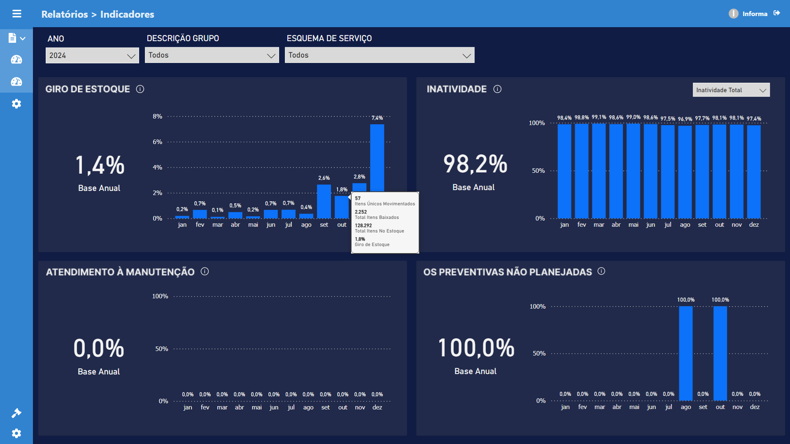
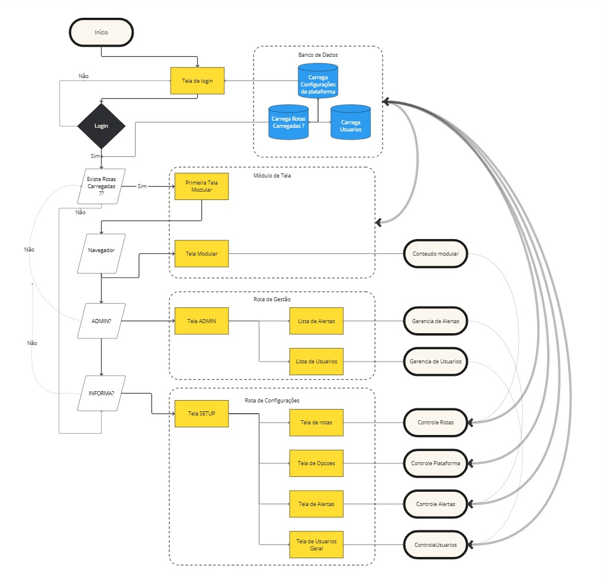

# Plataforma InformaAPP

Esta plataforma é uma solução completa para gestão, visualização de dados, administração de usuários e comunicação em tempo real, integrando recursos de autenticação, dashboards Power BI, gerenciamento de materiais e alertas, tudo em uma interface moderna e responsiva.

---

## Objetivos da Plataforma

- **Centralizar a gestão de usuários, permissões e rotas** de acesso.
- **Integrar dashboards do Power BI** para visualização de indicadores e relatórios.
- **Gerenciar materiais e grupos estratégicos** de estoque.
- **Emitir e gerenciar alertas** em tempo real.
- **Permitir comunicação e atualização de dados em tempo real** via Socket.IO.
- **Oferecer uma interface moderna, personalizável e segura** para diferentes perfis de usuários (Admin, Cliente, Funcionário, etc).

---





## Tecnologias Utilizadas

### Backend

- **Node.js**: Ambiente de execução JavaScript no servidor.
- **Express**: Framework para criação de APIs REST.
- **MongoDB (Mongoose)**: Banco de dados NoSQL para persistência dos dados.
- **Socket.IO**: Comunicação em tempo real (WebSockets).
- **JWT (jsonwebtoken)**: Autenticação baseada em tokens.
- **bcryptjs**: Criptografia de senhas.
- **dotenv**: Gerenciamento de variáveis de ambiente.
- **MSAL Node (@azure/msal-node)**: Integração com Microsoft Azure AD e Power BI.
- **Sequelize, pg, pg-hstore**: (Opcional) Suporte a bancos relacionais PostgreSQL.

### Frontend

- **React**: Biblioteca para construção de interfaces de usuário.
- **TypeScript**: Superset do JavaScript para tipagem estática.
- **Vite**: Bundler e servidor de desenvolvimento rápido.
- **Material UI (@mui/material)**: Componentes de UI modernos e responsivos.
- **Framer Motion**: Animações fluidas e interativas.
- **Axios**: Cliente HTTP para comunicação com a API.
- **Socket.IO Client**: Comunicação em tempo real com o backend.
- **Leaflet, Mapbox, react-leaflet, react-map-gl**: Visualização de mapas e geolocalização.
- **PowerBI Client**: Embedding de dashboards Power BI.
- **React Router DOM**: Gerenciamento de rotas no frontend.

---

## Funcionalidades Principais

- **Autenticação e Registro de Usuários** (com proteção de rotas e permissões).
- **Gestão de Usuários** (CRUD, alteração de senha, ativação/desativação).
- **Gerenciamento de Rotas Dinâmicas** (acesso controlado por perfil).
- **Dashboards Power BI** integrados e protegidos.
- **Gestão de Materiais e Grupos Estratégicos**.
- **Alertas em tempo real** (criação, edição, exclusão).
- **Configurações Dinâmicas da Plataforma** (tema, permissões, chaves de integração).
- **Comunicação em tempo real** (atualização de posições, alertas, etc).
- **Interface responsiva e personalizável**.

---

## Como Rodar a Aplicação

### 1. Clone o repositório

```bash
git clone <URL_DO_REPOSITORIO>
cd informaAPP
```

### 2. Configuração do Backend

```bash
cd backend
npm install
```

Crie um arquivo `.env` na pasta `backend` com o seguinte conteúdo (ajuste os valores conforme seu ambiente):

```env
MONGO_URI=mongodb://<usuario>:<senha>@localhost:27017/<nome_do_banco>
JWT_SECRET=<seu_segredo_para_token>
JWT_REFRESH_SECRET=<seu_segredo_para_refresh_token>
AZURE_APP_ID=<client_id>
AZURE_APP_SECRET=<client_secret>
POWER_BI_WORKSPACE_ID=<workspace_id>
PORT=5000
```

Inicie o servidor backend:

```bash
npm start
```

### 3. Configuração do Frontend

Abra outro terminal e execute:

```bash
cd frontend
npm install
npm run dev
```

Acesse o frontend em [http://localhost:5173](http://localhost:5173) (ou a porta indicada pelo Vite).

---

## Estrutura de Diretórios

```bash
informaAPP/
│
├── backend/
│ ├── controllers/
│ ├── models/
│ ├── routes/
│ ├── middleware/
│ ├── utils/
│ ├── server.js
│ └── .env
│
├── frontend/
│ ├── src/
│ │ ├── components/
│ │ ├── pages/
│ │ ├── services/
│ │ ├── utils/
│ │ ├── App.tsx
│ │ └── index.tsx
│ └── vite.config.ts
│
└── README.md
```




## Descrição das Dependências

### Backend

- **express**: Criação de rotas e middlewares HTTP.
- **mongoose**: Modelagem e comunicação com o MongoDB.
- **socket.io**: Comunicação bidirecional em tempo real.
- **jsonwebtoken**: Geração e validação de tokens JWT.
- **bcryptjs**: Hash e verificação de senhas.
- **dotenv**: Carregamento de variáveis de ambiente.
- **@azure/msal-node**: Autenticação com Azure AD e integração com Power BI.
- **cors**: Permitir requisições de diferentes origens (CORS).
- **sequelize, pg, pg-hstore**: (Opcional) ORM e drivers para PostgreSQL.

### Frontend

- **react, react-dom**: Construção da interface de usuário.
- **@mui/material, @mui/icons-material**: Componentes visuais e ícones.
- **framer-motion**: Animações.
- **axios**: Requisições HTTP.
- **socket.io-client**: Comunicação em tempo real com o backend.
- **leaflet, mapbox-gl, react-leaflet, react-map-gl**: Mapas e geolocalização.
- **powerbi-client**: Embedding de dashboards Power BI.
- **react-router-dom**: Navegação entre páginas.
- **typescript**: Tipagem estática para maior robustez.

---

## Funcionalidades Detalhadas

- **Login/Logout/Registro**: Usuários podem se registrar, logar e renovar tokens de acesso.
- **Gestão de Usuários**: Listagem, criação, edição, exclusão e alteração de senha.
- **Rotas Dinâmicas**: Backend fornece rotas e permissões, frontend monta menus e páginas dinamicamente.
- **Dashboards Power BI**: Visualização de relatórios com autenticação e embed seguro.
- **Alertas**: CRUD de alertas, com exibição em tempo real.
- **Configurações**: Tema, permissões, chaves de integração, tudo configurável via painel.
- **Comunicação em Tempo Real**: Atualização de dados e alertas instantâneos via WebSockets.

---

## Licença

Este projeto está sob a licença MIT.

---

**Dúvidas?**  
Abra uma issue ou entre em contato com o mantenedor do projeto.
